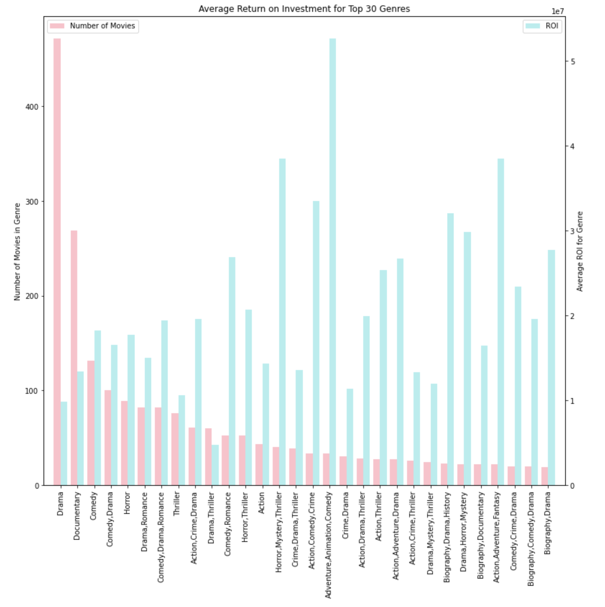
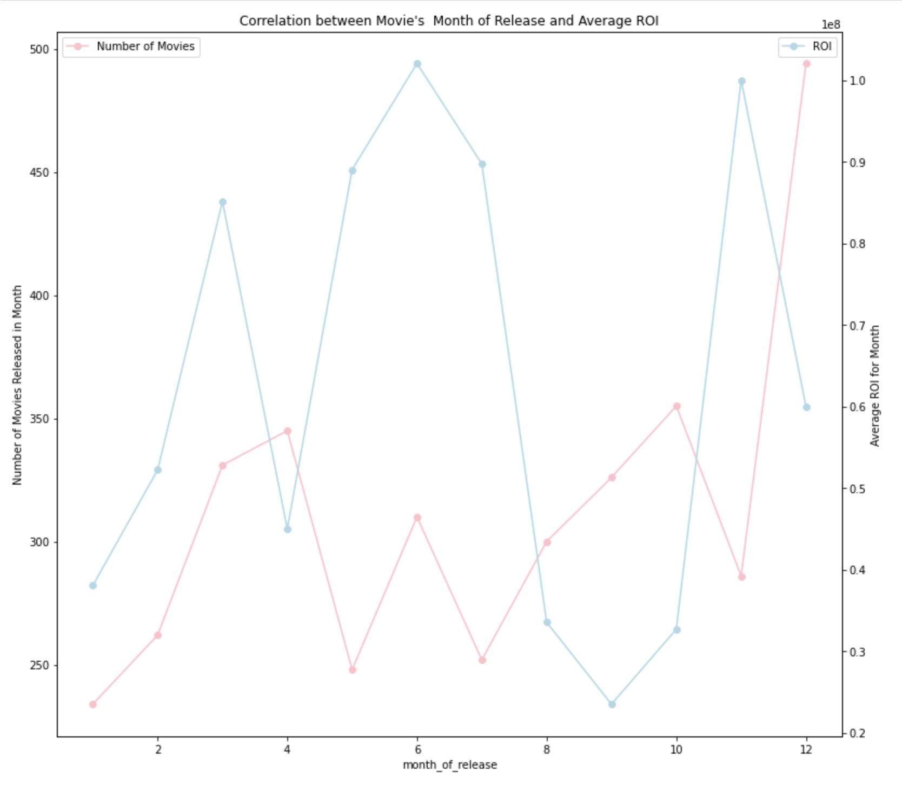
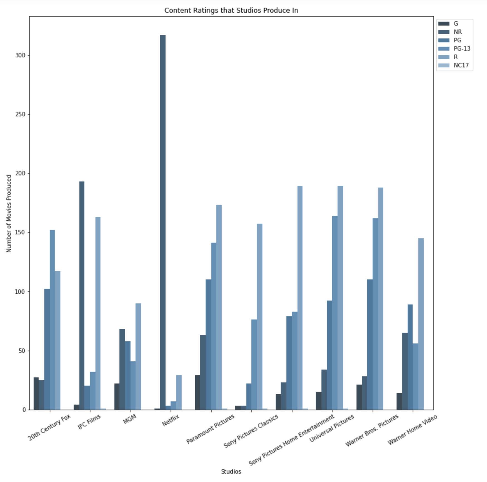

# Movie Industry Analysis for Microsoft

**Author**: Aziza Gulyamova


## Overview

The purpose of this project is to help Microsoft better understand movie industry and figure out what kind of movies are doing the best currently in world. Using this analysis Microsoft can build up a strategy for creating their own movies that will definetly hit the top.
Through this analysis, I will show some interesting trends in the data pertaining to what successful movies have in common. This analysis will mainly be done through the examination of provided datasets.

***

## Business Problem

In order to better understand the movie industry and find out what kind of movies Microsoft should produce to get the most of it, I analyzed the data sources and formulated 4 questions that Microsoft should consider before making the decision to enter movie industry and start filming:

* What genres are the most popular and giving the most profit?
* Is there a correlation between the average ratings and the runtime of the movie?
* Is there a correlation between movie's release date and gross profit?
* What are the Top 10 succesfull studios and what are their content ratings focus?

The questions will provide Microsoft valuable insight on which genres it should focus on to increase its likelihood of generating high gross sales. Does it need to consider the runtime of the movie when filming, what is the best time to release the movie for higher profit and what movie content it should focus on.

***

## Data

For this project, in order to analyze the world's movie industry, the Datasets are provided from different sources, such that:
* IMDB
* Box Office Mojo
* The Number movie Budgets
* Rotten Tomatoes

The datasets above contain various types of information about each movie, ranging from the release date, the director, the studio, to other information like the budget, the profit, the audience and critic scores from different sites.
***


## Methods

This Project uses descriptive analysis method, such that distribution and bar graphs, statistical functions. This method helps to examine the dataset, filter out less meaningfull data, compare differnt dataset and provide insights on relations between datasets.

Datasets

***
Questions to consider:
* How did you prepare, analyze or model the data?
* Why is this approach appropriate given the data and the business problem?
***

## Results
* The analysis shows that out of 30 Top genres the most profitable ones are "Adventure, Animation, Comedy", "Action, Adventure, Sci-Fi", "Action, Adventure, Fantasy" and "Action, Adventure, Comedy" genres. But the most produced genres are "Drama", "Documentary" and "Comedy" while having low return on investment.



* The caclulation of correlation between average rating and runtime of the movie, shows that these two datasets are not related.

* The most profitable months for movie releasing are May, June, July, November. During this months tickets sales are high, because of the summer time, where as in April, September, October and December are the least profitable times. The largest amount of movies are released in December, due to holiday season.




* The most common content rating is "R" rating, which is movies for audience older than 17. The least produced ones are "G"- General Audience and "PG" - Parental Guidance Suggested. Large amount of movies by "Netflix" have not been rated("NR" - not rated).




***
Questions to consider:
* How do you interpret the results?
* How confident are you that your results would generalize beyond the data you have?
***

Here is an example of how to embed images from your sub-folder:

### Visual 1


## Conclusions

Provide your conclusions about the work you've done, including any limitations or next steps.

***
Questions to consider:
* What would you recommend the business do as a result of this work?
* What are some reasons why your analysis might not fully solve the business problem?
* What else could you do in the future to improve this project?
***

## For More Information

Please review our full analysis in [our Jupyter Notebook](./dsc-phase1-project-template.ipynb) or our [presentation](./DS_Project_Presentation.pdf).

For any additional questions, please contact **name & email, name & email**

## Repository Structure

Describe the structure of your repository and its contents, for example:

```
├── README.md                           <- The top-level README for reviewers of this project
├── dsc-phase1-project-template.ipynb   <- Narrative documentation of analysis in Jupyter notebook
├── DS_Project_Presentation.pdf         <- PDF version of project presentation
├── data                                <- Both sourced externally and generated from code
└── images                              <- Both sourced externally and generated from code
```
